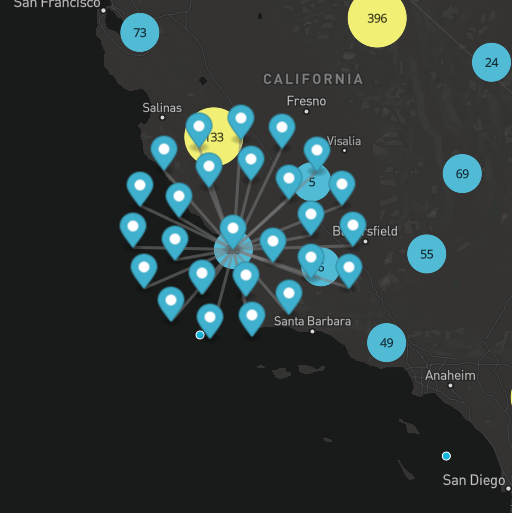

# Example of Mapbox GL js cluster spiderify

Mapbox GL js does not support native cluster spiderify, this repository is a proof a concept of it.

## Live demo

Needs a Mapbox token

[Codepen](https://codepen.io/FranckK/pen/qBWrJLV?)

## Screenshots

